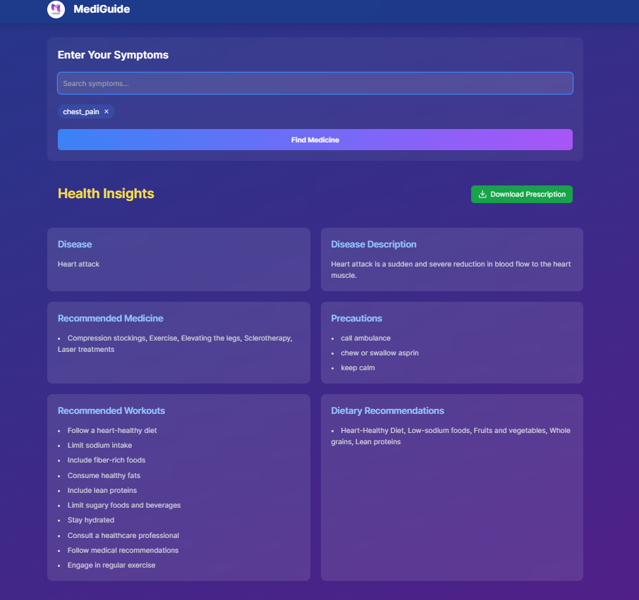
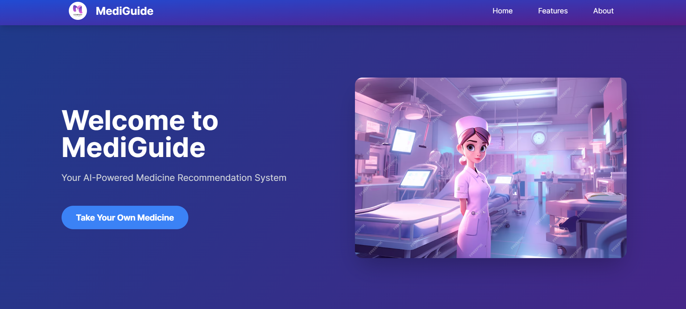
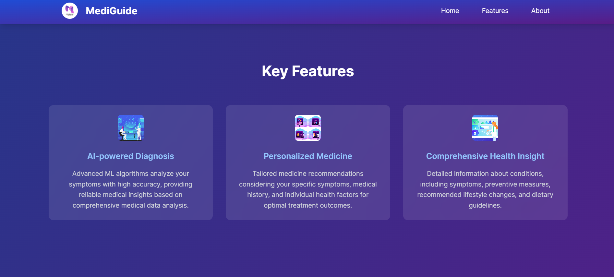

# **🏥 Medicine Recommendation System**

## **🌟 Project Overview**
- 🚀 An intelligent machine learning-based system that predicts diseases based on user symptoms and recommends appropriate medicines, precautions, workouts, and diets!

---

## **🚀 Features**
- ✅ **Predicts diseases based on user-entered symptoms**
- ✅ **Recommends the right medicines for the diagnosed disease**
- ✅ **Provides a detailed description of the disease**
- ✅ **Suggests precautions to take during illness**
- ✅ **Offers workout tips and guidelines for recovery**
- ✅ **Recommends a healthy diet plan for better healing**

---

## **🛠️ Technologies Used**
- **Python** 🐍
- **Flask** 🖥️
- **React.js , Tailwind css** 🌐

---

## **🎯 How It Works?**

1️⃣ **The user enters their symptoms on the website.**

2️⃣ **The system processes the input and predicts the disease using the trained ML model.**

3️⃣ **Based on the predicted disease, the system provides:**
   - **Recommended medicines**
   - **Description of the disease**
   - **Suggested precautions**
   - **Recommended workouts for better recovery**
   - **Diet plan for a healthier lifestyle**

4️⃣ **The user receives all the essential details to manage their condition effectively!**

---

## **🛠️ Installation & Setup**

- 📌 **Prerequisites**
      - **Make sure you have the following installed:**
        - **Python (>= 3.8)**
        - **Node.js & npm**
        - **Virtual Environment (venv or conda)**

  ---

      

## **📷 Screenshot**
- 
- 
- 

